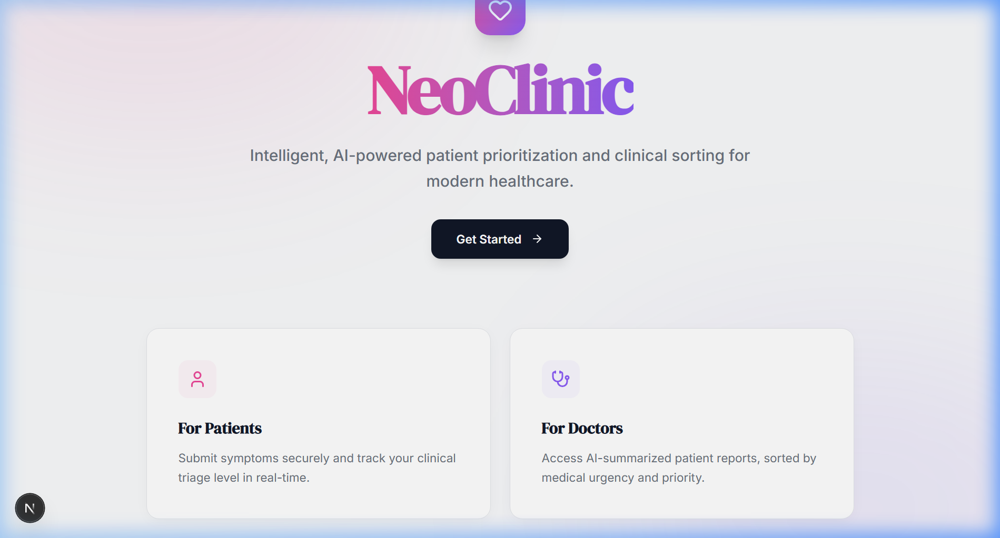
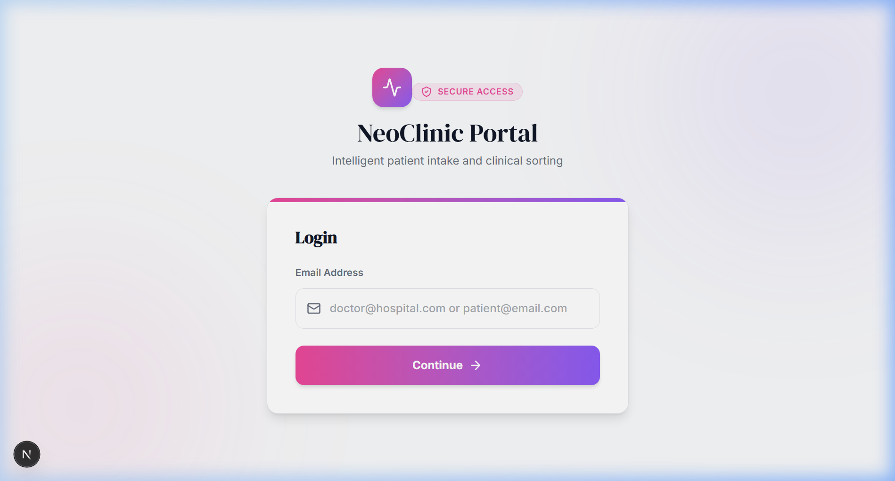
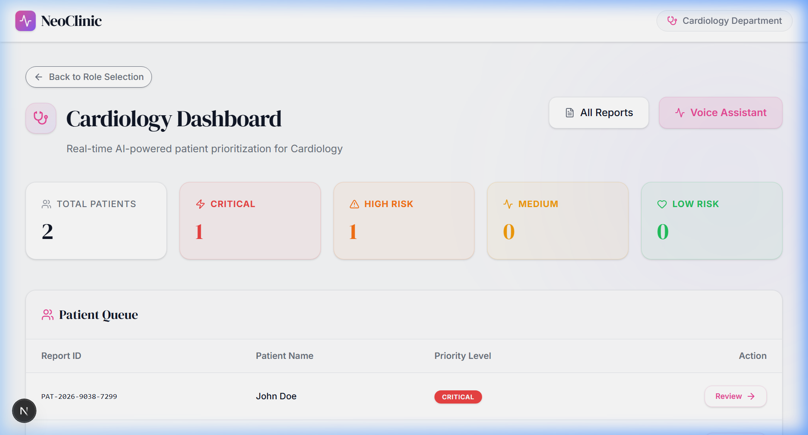

# NeoClinic — Intelligent AI Patient Triage System

**NeoClinic** is a premium, AI-powered clinical management platform designed to solve hospital wait-room bottlenecks and streamline patient intake. By intelligently analyzing symptoms in real-time and assigning clinical priority levels, it ensures that life-threatening cases are seen first while automating hours of clinical paperwork for doctors.



---

## 🏥 The Problem & Our Solution
In traditional healthcare settings, triage is manual and prone to bottlenecks. 
- **The Problem:** Long wait times, unsorted patient queues, and repetitive documentation.
- **The NeoClinic Solution:** An AI-first ecosystem that listens to patients (multilingual), calculates a medical **Triage Level (1–4)**, and generates structured clinical summaries instantly.

---

## ✨ Key Features

### 🩺 For Patients
*   **Intuitive Intake**: Simple, professional form interface with clear progress tracking.
*   **Multilingual Voice Assistant**: Patients can speak their symptoms in **15+ languages** (Hindi, Spanish, French, etc.). The AI automatically transcribes and translates it into structured English for the clinician.
*   **Real-Time Assessment**: Instant feedback on their triage level and department routing.

### 👩‍⚕️ For Doctors
*   **Prioritized Queue**: A live-updating dashboard where patients are automatically sorted by medical urgency—**CRITICAL cases stay at the top**.
*   **AI Clinical Reports**: Detailed report views containing extracted symptoms, risk indicators, and an AI-generated assessment.
*   **AI Voice Dictation Assistant**: A dedicated voice tool for clinicians to record notes and generate clinical summaries on the fly.
*   **Triage Level System**: Replaced legacy "scores" with a clinical **Triage Level (1–4)** for better medical alignment across the platform.

---

## 📸 Screenshots

| Patient Intake | Doctor Dashboard |
|---|---|
|  |  |

---

## 🏗 Technical Architecture

### **Frontend**
- **Next.js 14+**: Leveraged App Router for high-performance routing and server components.
- **Tailwind CSS**: Custom "NeoClinic" design system with accessible hospital-grade aesthetics.
- **Framer Motion**: Smooth micro-animations for a premium, responsive feel.
- **Lucide React**: Clean, medical-grade iconography.

### **Backend & AI Logic**
- **Node.js & Express**: High-concurrency server handling triage logic and API routes.
- **Google Gemini 2.0 Flash**: The core "brain" of NeoClinic. Handles:
    - **Priority Scoring**: Medical reasoning for Triage Levels (1–4).
    - **Clinical Extraction**: Identifying risk factors from raw text.
    - **Report Summarization**: Converting patient descriptions into clinical notes.
- **Web Speech API & NLP**: Real-time voice processing and translations.
- **Supabase**: PostgreSQL database for secure, scalable patient report and auth management.

---

## 🎨 Design System: "SaaS Premium Medical"
NeoClinic follows a strict visual guideline to ensure reliability and professionalism:
- **Typography:** DM Serif Display (Large Headers), Inter (Body Text).
- **Color Palette:**
    - **Background:** `#F9FAFB` (Clinical Gray/White)
    - **Accent Glow:** Gradient Pink (`#EC4899`) to Purple (`#8B5CF6`) - for highlights and CTA buttons.
    - **Priority Tags:** Solid Red (Emergency), Yellow (High/Warning), Green (Stable).
- **Layouts:** Rounded-2xl cards with soft borders (`#E5E7EB`) and layered background glows.

---

## 📂 Project Structure
```bash
/frontend
  ├── src/app          # Next.js Pages (Patient & Doctor Portals)
  ├── src/components   # Shared UI components (MicInput, VoiceRecorder, etc.)
  ├── assets/          # Project screenshots and branding assets
/backend
  ├── routes           # API endpoints (AI, Auth, Patient Data)
  ├── utils            # AI logic (priorityCalculator, visionAnalyzer)
  ├── config           # Supabase & environment configuration
/nlp                   # Python scripts for legacy symptom processing
```

---

## 🚀 Getting Started

### 1. Requirements
- Node.js installed on your local machine.
- Python 3.8+ (for NLP fallback module).
- A **Google Gemini API Key** (for Gemini 2.0 Flash triage reasoning).

### 2. Backend Setup
```bash
cd backend
npm install
```
Configure `.env` (refer to `.env.example` in the repo):
```env
GEMINI_API_KEY=your_key_here
SUPABASE_URL=...
SUPABASE_KEY=...
```
Run: `npm run dev`

### 3. NLP Module Setup (Optional)
```bash
cd nlp
pip install -r requirements.txt
python -m spacy download en_core_web_sm
```

### 4. Frontend Setup
```bash
cd frontend
npm install
npm run dev
```
Access the application at `http://localhost:3000`.

---

## 📄 License
This project is licensed under the MIT License.

---

Developed with ❤️ for **HackCrux 2026** — Transforming triage with intelligence.
